# 📘 CX Tool - Comprehensive Documentation

Welcome to the detailed documentation for the **Advanced CX Management Platform**. This guide covers every module and functionality available in the portal.

---

## 🔐 Access Portal (Login)
The gateway to the secure CX command center. Supports session persistence and encrypted link generation.

---

## 📊 Management Dashboard
A high-level command center displaying critical KPIs including Active Customers, Health at Risk, and Upcoming Renewals.

---

## 📂 Customer Directory
Manage your entire portfolio. Segmented views for Customers, Prospects, and Partners with detailed account ownership tracking.
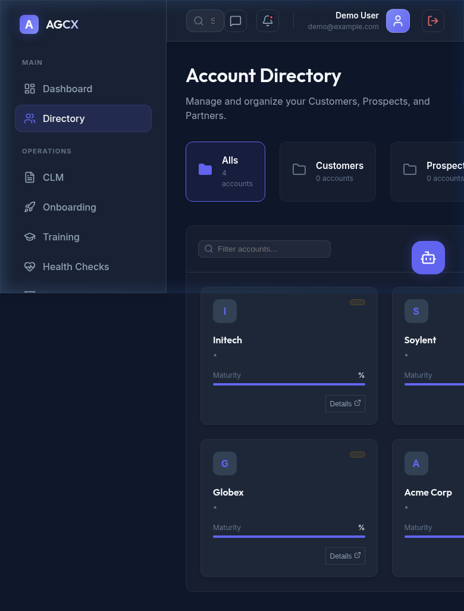

---

## 📜 CLM (Contract Lifecycle Management)
Track the entire sales and renewal pipeline. Monitor contract stages from drafting to active status with value tracking.
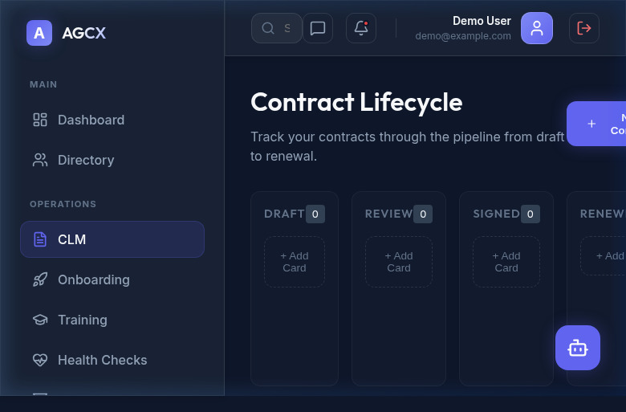

---

## 🚀 Onboarding Tracker
Ensure fast time-to-value for new clients. Milestone-based tracking system from Kickoff to Platform Launch.
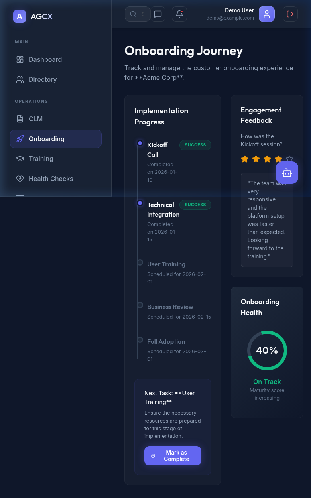

---

## 🎓 Customer Training & Enablement
Centralized hub for managing customer certifications, enablement workshops, and training progress.
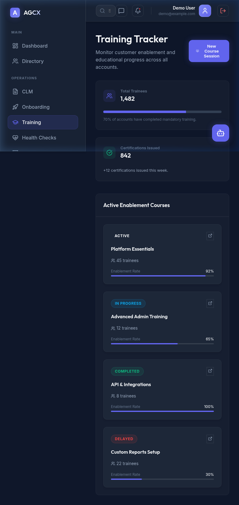

---

## 🏥 Health Checks
Proactive churn prevention system. Categorize accounts by health status (Healthy, Needs Attention, At Risk) with scoring.
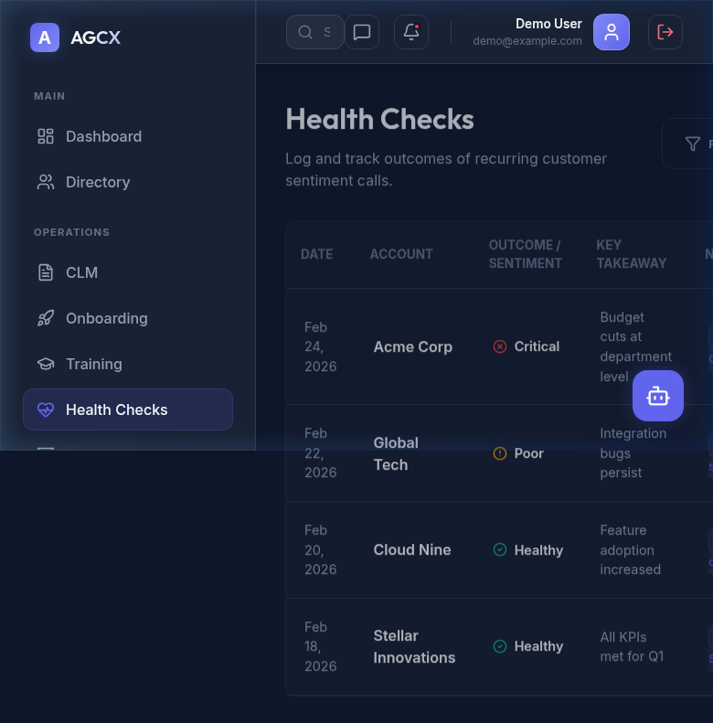

---

## 🤝 EBR (Executive Business Reviews)
Schedule and track strategic alignment meetings. Log outcomes and next steps for high-level business reviews.
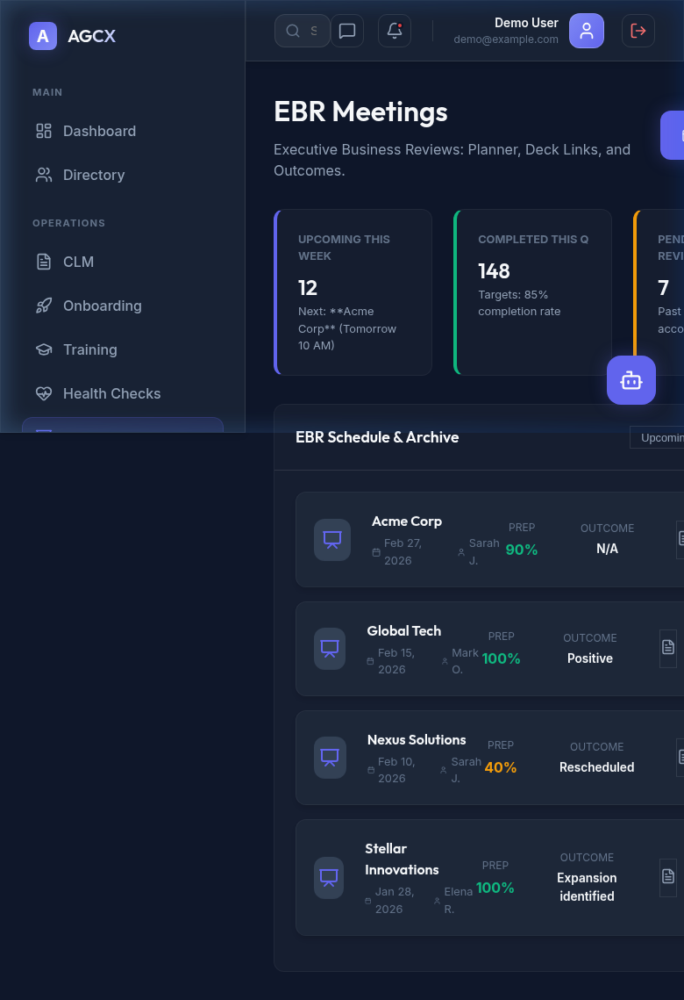

---

## 🎤 Surveys (NPS/CSAT)
Voice of the Customer (VoC) module. Collect and analyze sentiment via automated survey triggers.
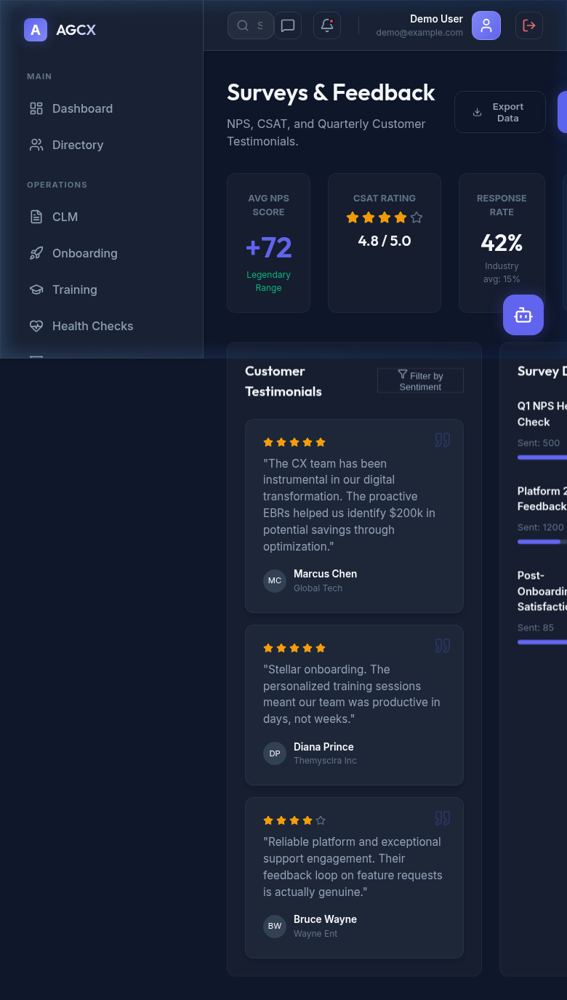

---

## 🗺️ Journey Map
Visualize the end-to-end customer lifecycle. Identify friction points and optimize the post-sale experience.
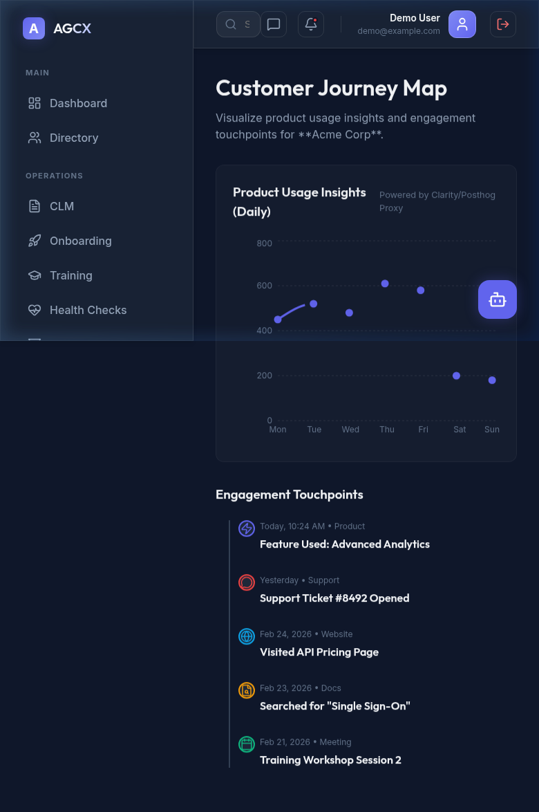

---

## 📈 Support Metrics
Real-time integration views for ticket volumes, response times, and resolution rates.
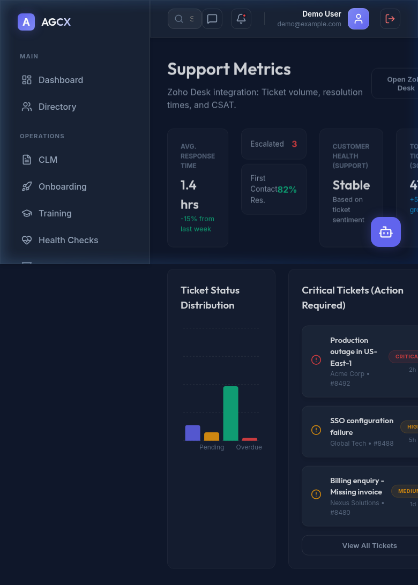

---

## 💡 Feature Requests
Crowdsource and prioritize product feedback. Link customer requests directly to the engineering roadmap.
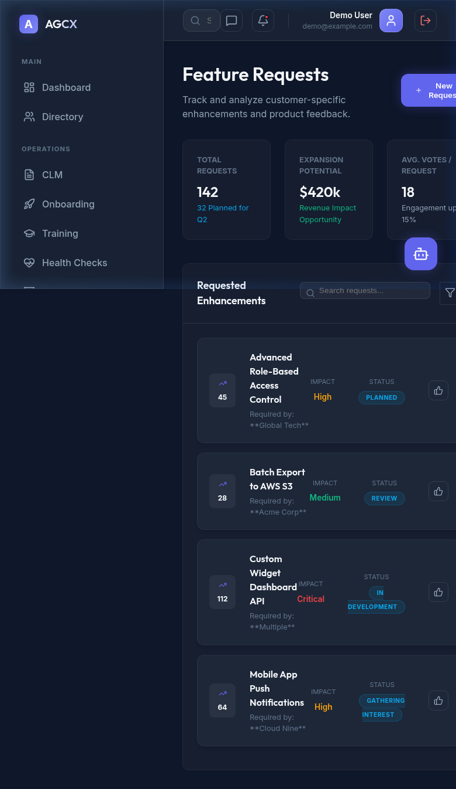

---

## 💰 Expansion & Upsells
Track growth opportunities within existing accounts. Monitor expansion pipeline and cross-sell potential.
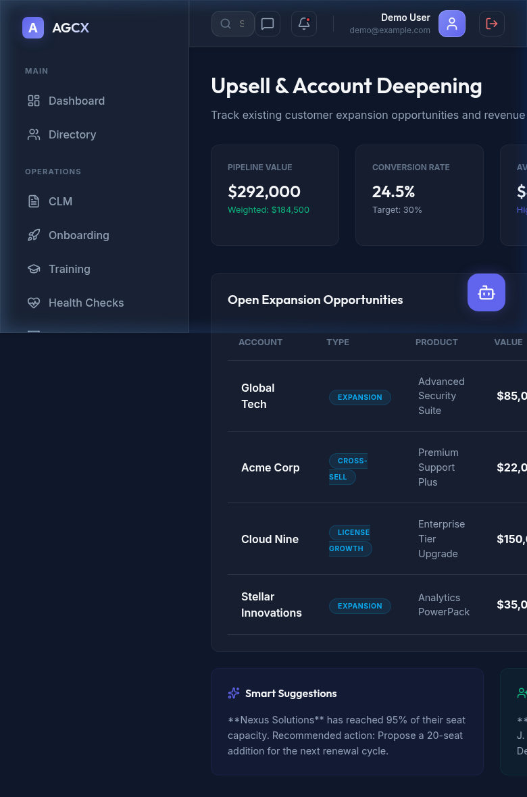

---

## 💬 Comms Hub
Centralized logging of every customer interaction. Sync emails, calls, and automated outreach.
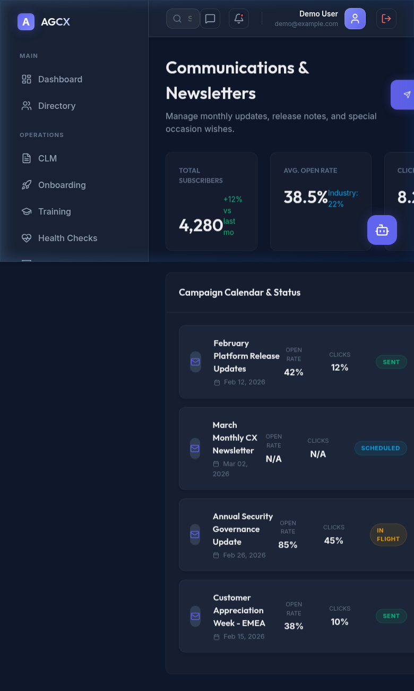

---

## 📅 Events & User Groups
Manage webinars, product workshops, and customer community events from a single calendar.
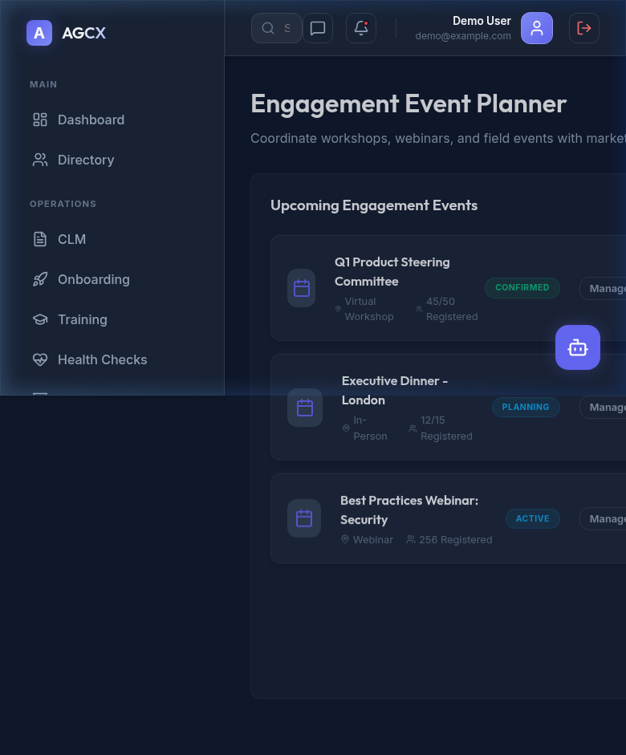
