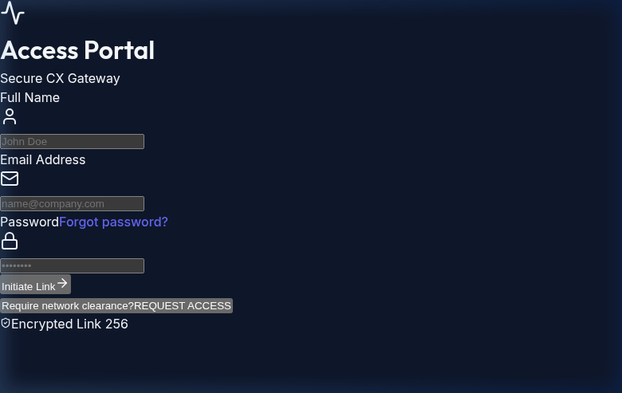
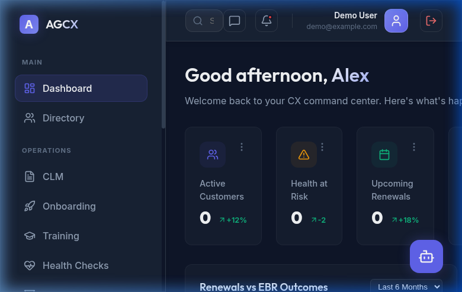

# 🚀 Advanced CX Management Platform

A highly interactive, full-stack Customer Experience (CX) Portal built with **React**, **Vite**, **Express**, and **SQLite**. This platform serves as a modern command center for Customer Success teams to track account health, manage contracts, run onboarding flows, and centralize communications.

## 🌟 Key Features

The platform is designed to replace fragmented tools (like spreadsheets, disparate ticketing systems, and static CRMs) into a single, beautiful dashboard.

### 📊 Portfolio Management
* **Interactive Dashboard:** High-level metrics on Gross/Net Retention, Churn Risk, and upcoming Renewals powered by interactive charts (`recharts`).
* **Customer Directory:** A comprehensive rolodex of all client accounts segmented by Customers, Prospects, and Partners.
* **Health Checks:** Proactive account scoring and risk categorization to prevent churn.

### 🔄 Lifecycle & Engagement
* **CLM (Contract Lifecycle Management):** Track contract stages, pipeline value, and renewal dates.
* **Onboarding Tracker:** Step-by-step milestone tracking from kickoff to launch to ensure fast time-to-value for new clients.
* **Customer Training:** A centralized hub to manage and track customer enablement and certification progress.
* **Events & Webinars:** Manage user groups, product workshops, and customer engagement events.

### 💬 Voice of the Customer (VoC)
* **Feature Requests:** Capture, prioritize, and track customer feature requests tied directly to the product roadmap.
* **Surveys (NPS/CSAT):** Analyze sentiment and feedback from customer health surveys.
* **Comms Hub:** Centralized logging of customer touchpoints, health scores, and automated outreach triggers.

### 🤖 Smart Assistant (AI)
* A persistent, context-aware "Smart Assistant" built into the portal. It acts as a co-pilot for Customer Success Managers to summarize account health, draft emails, and highlight churn risks.

---

---

## 🎨 Design & Architecture
* **Frontend:** Built with React 19 + Vite. Features a highly premium, futuristic "glassmorphic" design system with massive animated glowing orbs, parallax effects, and smooth transitions.
* **Backend:** A lightweight `Express` REST API running on `Node.js`.
* **Database:** `SQLite` integration allowing for instant, zero-configuration local deployment and persistent data storage.
* **Authentication:** Full JWT (JSON Web Token) implementation with hashed passwords (`bcrypt`) securing all API routes.

---

## 📸 Snapshots

### Login Portal


### Management Dashboard


---

## 🛠️ Local Development Setup

To run the application locally, you will need to start both the backend API and the frontend Vite server.

### 1. Start the Backend API (Port 5000)
The backend uses SQLite to store your Customer and Contract data, and manages secure Login sessions.
```bash
cd server
npm install
npm start
```

### 2. Start the Frontend App (Port 5173)
Open a new terminal window at the root of the project to start the React interface.
```bash
npm install
npm run dev
```

### 3. Login
Navigate to `http://localhost:5173/login` in your browser.

The database is initially seeded with a demo user:
* **Email:** `demo@example.com`
* **Password:** `password123`

You can also use the futuristic "Generate Identity" flow to create a new user account!
