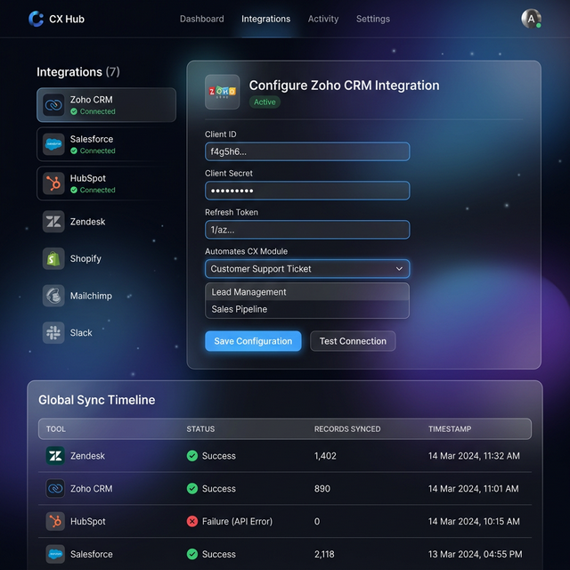
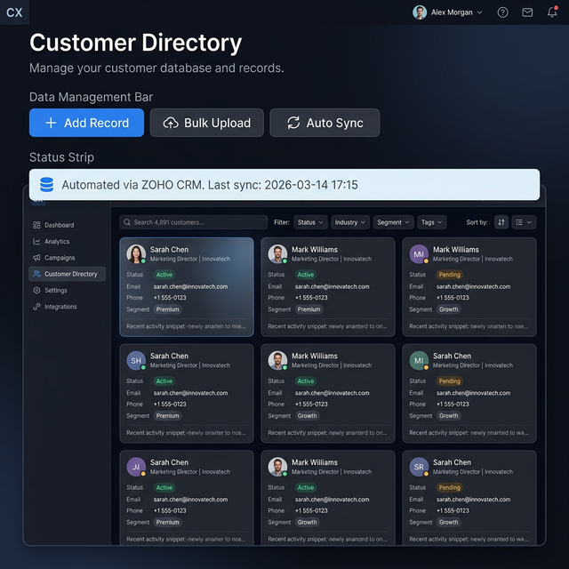

# 🚀 Advanced CX Management Platform

A highly interactive, full-stack Customer Experience (CX) Portal built with **React**, **Vite**, **Express**, and **SQLite**. This platform serves as a modern command center for Customer Success teams to track account health, manage contracts, run onboarding flows, and centralize communications—all powered by a real-time backend and an advanced AI co-pilot.

### 📖 [View Full Documentation & Feature Snapshots](DOCUMENTATION.md)

## 🌟 Key Features

The platform is fully functional, moving beyond static mockups to a live, data-driven experience.

### 📊 Portfolio Management
* **Interactive Dashboard:** Live metrics on Gross/Net Retention, Churn Risk, and upcoming Renewals powered by interactive charts (`recharts`) and real SQLite data.
* **Customer Directory:** A comprehensive, persistent rolodex of all client accounts segmented by Customers, Prospects, and Partners.
* **Health Checks:** Proactive account scoring and risk categorization with full data persistence.

### 🔄 Lifecycle & Engagement
* **CLM (Contract Lifecycle Management):** Track contract stages, pipeline value, and renewal dates with dynamic updates.
* **Onboarding Tracker:** Step-by-step milestone tracking from kickoff to launch. Real-time progress updates for every account.
* **Customer Training:** A centralized hub to manage and track customer enablement and certification progress.
* **Events & Webinars:** Coordinate and track customer engagement events through the live backend.

### 💬 Voice of the Customer (VoC)
* **Feature Requests:** Capture, prioritize, and vote on customer feature requests.
* **Surveys (NPS/CSAT):** Distribution and analysis of customer health surveys with live response tracking.
* **Comms Hub:** Centralized campaign management and automated outreach triggers.

### 🤖 Smart Assistant (AI)
* **Real-Time Intelligence:** A context-aware AI co-pilot that analyzes your SQLite database to answer specific questions about NPS, account health, and revenue forecasting.
* **Risk Identification:** Automatically flags "Critical" or "Poor" health accounts upon request.
* **Future Predictions:** Provides data-driven forecasts for expansion revenue and platform growth.

---

---

## 🎨 Design & Architecture
* **Frontend:** Built with React 19 + Vite. Features a highly premium, futuristic "glassmorphic" design system with massive animated glowing orbs, parallax effects, and smooth transitions.
* **Backend:** A lightweight `Express` REST API running on `Node.js`.
* **Database:** `SQLite` integration allowing for instant, zero-configuration local deployment and persistent data storage.
* **Authentication:** Full JWT (JSON Web Token) implementation with hashed passwords (`bcrypt`) securing all API routes.

---

## 📸 Snapshots

### Management Dashboard


### Connectivity Hub & Module Sync



---

## 🛠️ Local Development Setup

To run the application locally, you will need to start both the backend API and the frontend Vite server.

### 1. Start the Backend API (Port 5000)
The backend uses SQLite to store your Customer and Contract data, and manages secure Login sessions.
```bash
cd server
npm install
npm start
```

### 2. Start the Frontend App (Port 5173)
Open a new terminal window at the root of the project to start the React interface.
```bash
npm install
npm run dev
```

### 3. Login
Navigate to `http://localhost:5173/login` in your browser.

The database is initially seeded with a demo user:
* **Email:** `demo@example.com`
* **Password:** `password123`

You can also use the futuristic "Generate Identity" flow to create a new user account!
